# Active Discovery

This project introduces you to the basics of system administration under the Microsoft Server operating system.
In this project, you are introduced to the functionality and features of Active Directory (AD).

## Table of Content

- [What is an active directory?](#what-is-an-active-directory)
- [Requirement](#requirement)
   - [Forest creation](#forest-creation)
   - [Domain controller configuration](#domain-controller-configuration)
   - [Resources creation](#resources-creation)
   - [User account creation](#user-account-creation)
- [Walkthrough](#walkthrough)
   - [But wait, what do we mean? a forest?](#but-wait-what-do-we-mean--a-forest-)
   - [Forest Architecture Options](#forest-architecture-options)
      - [What is Replication?](#what-is-replication)
   - [What We're Building: Single-Domain Forest](#what-were-building-single-domain-forest)
   - [Creating the Forest on Windows Server 2025](#creating-the-forest-on-windows-server-2025)
      - [Change the server name](#but-before-that-lets-change-the-server-name)
      - [Set a static IP address](#--and-set-a-static-ip-address)
      - [Install Active Directory and create forest](#now-that-the-static-ip-is-set-lets-proceed-to-install-active-directory-and-create-our-forest-)
      - [Verifying Your Forest](#verifying-your-forest)
   - [Now let's configure the Domain controller](#now-lets-configure-the-domain-controller)
   - [User account creation and resources creation](#user-account-creation-and-resources-creation)
   - [Connecting Windows 11 Workstation to the Domain](#connecting-windows-11-workstation-to-the-domain)
   - [References and Resources](#resources)


### What is an active directory ?

**Active Directory (AD)** is Microsoft's directory service built into Windows Server. It is a centralized system that stores information about users (+ their devices like pc or printer etc..) and also handles logging in (authentication) and permissions (authorization).

**Here are the key benefits:**
- **One login, many services**: Create a user account once, use it everywhere on the network
- **Centralized management**: Manage thousands of users/computers from one place
- **Security**: Control who can access what, enforce password policies, audit activity
- **Group Policy**: Push settings, software, and scripts to all computers automatically

Although, the term **active directory** often refer to windows since it runs on a windows server, it uses open protocols ([LDAP](https://en.wikipedia.org/wiki/Lightweight_Directory_Access_Protocol), [Kerberos](https://en.wikipedia.org/wiki/Kerberos_(protocol))...).
So there are open-source alternatives like [Samba AD DC](https://samba.tranquil.it/doc/fr/index.html) or [FreeIPA](https://www.freeipa.org/page/Main_Page) that could serve as an active directory without using windows.


## Requirement
In this project, you will install and configure the computer infrastructure for "Domolia," a company that specializes in selling home automation tools.

The company is divided into two buildings:
	• A workshop, managed by a supervisor, with several workers.
	• An office or administration, where the company manager is located.

The company requires **two Microsoft Server installations**, one in each building, along with a **Windows workstation** that will connect to the respective building’s server.

### Forest creation
In this part, you have to install and configure the **server** located in the **administration** building.
The server must have the **Active Directory Domain Controller service** installed and configured.
You need to add any necessary modules you think are required for this service.
The server must have a suitable name that allows easy identification on the network.
You should *create a forest on the server* and choose an intelligent name for it.


### Domain controller configuration
In this part, you need to **connect the second server to the first one** in order to enable it to join the existing forest.
This server will be responsible for **hosting its own domain controller**.
Similar to the previous server, you should choose an appropriate name for this server.

### Resources creation
In this part, you are required to create three different folders where users can store important files.
	• Create a folder on the **Administration server** specifically for storing administrative files.
	• Create another folder on the **Administration server** for storing generic data and files.
	• Lastly, create a folder on the **Workshop server** dedicated to storing working project files.
Ensure that you give clear and descriptive names to these resources so that you can easily identify the contents they hold.

### User account creation
In this part, you need to create a user account on each of the previously created controllers.
The account on the administration server should have the ability to view and edit the administration resources folder and the generic resources folder.
On the workshop server, the account should have the capability to view and edit the working resources folder and the generic resources folder.


## Walkthrough

Since this is a fairely new project from the 42 network, in our campus we still don't have access to the VM environment so we need an extra step to create it.

From what the subject is telling us, we need 2 VM of Microsoft Server and 2 Windows Workstation that will connect to their respective server.

> You can get the ISO of Windows server 2025 LTS version [here](https://www.microsoft.com/en-us/evalcenter/evaluate-windows-server-2025) and Windows 11 LTS version [here](https://www.microsoft.com/en-us/evalcenter/evaluate-windows-11-enterprise)

You can then configure your vm on the manager of your choice. 
Don't forget to choose the desktop version (for the graphical interface) when installing your windows server !

You can finish installing your 4 VM or installing them as we move forward and connect to the windows server office (this may take some time).
If you want, you can create partitions but it's ok if you don't. The reason we may want to create partitions would be if the files on one of our windows server get to big, where there are no removing file policy. The disk may become saturated meaning the windows server os may no longer work since they are on the same partitions. But for this project this is not really necessary.

Make sure to create a network that will link them all together. With virtualbox, go to `settings>networks` and create a new NAT network by clicking to `file>host network manager` and create a new network.
Then click on `adapter 2`, enable and attached to "`host only adapter`" and choose the same network name for the 4 vm.

Log in (go to input to send the ctrl+alt+sup signal) the windows manager application will appear.
If you ever have some update, it could be good to install them !

From then, lets configure our forest !

### But wait, what do we mean ? a forest ?

In Active Directory, a **forest** is the highest level of organization — it's the security and administrative boundary that contains everything in your AD infrastructure. Think of it like this:
- A **forest** is like a company
- **Domains** are like departments within that company
- **Organizational Units (OUs)** are like teams within those departments
- **Users and computers** are the actual people and equipment

When you create a forest, you're creating:
1. The **root domain** (the first domain, which becomes the forest name)
2. The **schema** (the rulebook defining what types of objects can exist: users, computers, printers, etc.)
3. The **configuration container** (settings shared across all domains in the forest)
4. **Trust relationships** (automatic two-way trusts between all domains in the forest)


**Why is it called a "forest"?** Because it can contain multiple **trees** (domain hierarchies), and trees contain **branches** (child domains). But for most organizations, you only need one tree with one domain.

The physcal architecture of the AD relies on multiple domaine controlers (DC) that syncronize data between them ensuring information consistancy. We can view our windows server as a DC that run the Active Directory services (AD DS).
They handle the comuncations between domain and user:
- **Authentication**: When a user logs in, the DC verifies their credentials (username/password) against the AD database.
- **Authorization**: The DC checks what resources the user is allowed to access based on their group memberships and permissions set in AD.
- **Directory Management**: The DC stores and manages all the AD objects (users, computers, groups, OUs) and responds to queries from clients looking for information.
- **Group Policy Enforcement**: The DC applies Group Policies to users and computers when they log in or refresh their policies.
- **Replication**: DCs automatically synchronize their AD database with other DCs in the same domain, ensuring all controllers have identical, up-to-date information.

#### In summary: Forest, Tree, Domain, and Organizational Units

| Concept | Definition | Example |
|---------|------------|----------|
| **Domain** | A logical group of users, computers, and resources that share the same AD database and security policies. Has a single DNS namespace. | `domolia.local` |
| **Tree** | A collection of one or more domains that share a **contiguous DNS namespace** (parent-child relationship). The first domain in a tree is the **root domain** of that tree. | `domolia.local` → `workshop.domolia.local` → `paris.workshop.domolia.local` |
| **Forest** | The top-level container that holds one or more trees. All trees in a forest share the same schema and global catalog. The first domain ever created becomes the **forest root domain**. | A forest containing `domolia.local` tree and `partner.com` tree |
| **Organizational Unit (OU)** | A container within Active Directory used to organize users, computers, and other objects hierarchically. **OUs are not file system folders**—they exist only in AD for management and policy application. | `DOMOLIA\Administration OU` (holds `admin.user` account); `DOMOLIA\Workshop OU` (holds `workshop.user` account) |

**Important distinctions:**
- **Root Domain**: The very first domain created in a forest. It holds special roles (Schema Master, Domain Naming Master) and cannot be removed without destroying the entire forest.
- **Tree vs Domain**: A tree IS a domain hierarchy. A single domain by itself is also a tree (with just one node). Multiple domains form a tree only when they share contiguous DNS names (e.g., `child.parent.local`).
- **Multiple DCs ≠ Multiple Domains**: You can have 10 Domain Controllers all serving the **same** domain for redundancy.
- **OUs** = containers in Active Directory for organizing *user accounts* and applying *Group Policies*. You could also delegate control of OUs to different admin sections (e.g., Sales department manager can manage `Sales OU` users) by using [RSAT tools](https://www.manageengine.com/products/ad-manager/remote-server-administration-tools.html).
- **File System Folders** (shares) = directories on disk for storing *data files*
You need **both**: OUs to organize users in AD, and folders on disk for those users to store files in.


### Forest Architecture Options

When designing your Active Directory, you need to choose an architecture. Here are the main options:

**Option 1: Single-Domain Forest (Single Tree with One Domain)**
```
┌─────────────────────────────────────────────────────────────┐
│ FOREST: domolia.local                                       │
│ ┌─────────────────────────────────────────────────────────┐ │
│ │ TREE: domolia.local                                     │ │
│ │ ┌─────────────────────────────────────────────────────┐ │ │
│ │ │ ROOT DOMAIN: domolia.local                          │ │ │
│ │ │                                                     │ │ │
│ │ │   ┌──────────────┐      ┌──────────────┐            │ │ │
│ │ │   │ DC1-ADMIN    │ ←──→ │ DC2-WORKSHOP │            │ │ │
│ │ │   │ 10.0.1.10    │ repl │ 10.0.2.10    │            │ │ │
│ │ │   │ (Admin Bldg) │ ication (Workshop)  │            │ │ │
│ │ │   └──────────────┘      └──────────────┘            │ │ │
│ │ │        ↓                      ↓                     │ │ │
│ │ │   Same domain database (users, groups, policies)    │ │ │
│ │ │                                                     │ │ │
│ │ │   OU: Administration    OU: Workshop                │ │ │
│ │ │     └─ admin.user         └─ workshop.user          │ │ │
│ │ │   OU: Groups                                        │ │ │
│ │ │     ├─ GG_Admin_RW                                  │ │ │
│ │ │     ├─ GG_Generic_RW                                │ │ │
│ │ │     └─ GG_Projects_RW                               │ │ │
│ │ └─────────────────────────────────────────────────────┘ │ │
│ └─────────────────────────────────────────────────────────┘ │
└─────────────────────────────────────────────────────────────┘
```

**Key points for Option 1:**
- ✅ **`domolia.local` is the root domain** (it's the first and only domain)
- ✅ The forest name = tree name = domain name (all `domolia.local`)
- ✅ DC1 and DC2 are **both controllers for the SAME domain** — they replicate identical data
- ✅ One security boundary, one set of policies, one user database

**Characteristics:**
- One domain = one security boundary
- All users see each other in the Global Address List
- Simplest to manage and backup
- Multiple Domain Controllers (DCs) provide redundancy and load balancing
- Both DCs replicate the same database — if one fails, the other continues

**When to use:** Small to medium businesses (under 10,000 users), single organization, no need to delegate different IT teams, perfect for our setup


**Option 2: Multi-Domain Forest (Single Tree with Parent + Child Domains)**

```
┌─────────────────────────────────────────────────────────────────┐
│ FOREST: domolia.local                                           │
│ ┌─────────────────────────────────────────────────────────────┐ │
│ │ TREE: domolia.local (contiguous namespace)                  │ │
│ │                                                             │ │
│ │   ┌─────────────────────────────────────┐                   │ │
│ │   │ ROOT DOMAIN: domolia.local          │ ← Forest root     │ │
│ │   │   └─ DC1-ADMIN (HQ)                 │                   │ │
│ │   │   └─ OU: Administration             │                   │ │
│ │   │   └─ Own user database & policies   │                   │ │
│ │   └─────────────────────────────────────┘                   │ │
│ │                    │                                        │ │
│ │              Parent-Child                                   │ │
│ │              Trust (automatic)                              │ │
│ │                    │                                        │ │
│ │                    ▼                                        │ │
│ │   ┌─────────────────────────────────────┐                   │ │
│ │   │ CHILD DOMAIN: workshop.domolia.local│ ← Separate domain │ │
│ │   │   └─ DC2-WORKSHOP                   │                   │ │
│ │   │   └─ OU: Workshop                   │                   │ │
│ │   │   └─ Own user database & policies   │ ← Different from  │ │
│ │   └─────────────────────────────────────┘   parent!         │ │
│ └─────────────────────────────────────────────────────────────┘ │
└─────────────────────────────────────────────────────────────────┘
```

**Key points for Option 2:**
- `domolia.local` is the **root domain** (created first, holds forest-wide roles)
- `workshop.domolia.local` is a **child domain** (notice the contiguous namespace: `workshop` + `.domolia.local`)
- Each domain has its **OWN separate user database** — a user in `workshop.domolia.local` doesn't exist in `domolia.local`
- DC1 and DC2 manage **DIFFERENT domains** — they don't replicate user data between them
- Trust allows users to access resources across domains, but they remain separate security boundaries

**Characteristics:**
- Each domain has its own security boundary
- Users in workshop.domolia.local have separate passwords/policies from domolia.local
- Automatic two-way trusts between domains (users can access resources across domains)
- More complex replication (schema + configuration replicate forest-wide, but user data stays per-domain)

**When to use:** Large enterprises, separate IT teams per location, different password policies needed, political/organizational boundaries

**Option 3: Multi-Tree Forest (Multiple Trees with Different Namespaces)**
```
┌───────────────────────────────────────────────────────────────────────┐
│ FOREST: domolia.local (named after the first domain created)          │
│                                                                       │
│ ┌─────────────────────────────┐    ┌────────────────────────────────┐ │
│ │ TREE 1: domolia.local       │    │ TREE 2: partner-company.com    │ │
│ │ (original company)          │    │ (acquired company - different  │ │
│ │                             │    │  DNS namespace!)               │ │
│ │ ┌─────────────────────────┐ │    │ ┌────────────────────────────┐ │ │
│ │ │ROOT DOMAIN:domolia.local│ │←──→│ │ROOT DOMAIN:                │ │ │
│ │ │ (also FOREST root)      │ │Tree│ │partner-company.com         │ │ │
│ │ │  └─ DC: HQ servers      │ │Trust │  └─ DC: Partner servers    │ │ │
│ │ └─────────────────────────┘ │    │ └────────────────────────────┘ │ │
│ │            │                │    │             │                  │ │
│ │            ▼                │    │             ▼                  │ │
│ │ ┌─────────────────────────┐ │    │ ┌────────────────────────────┐ │ │
│ │ │workshop.domolia.local   │ │    │ │ sales.partner-company.com  │ │ │
│ │ │ (child domain)          │ │    │ │ (child domain)             │ │ │
│ │ └─────────────────────────┘ │    │ └────────────────────────────┘ │ │
│ └─────────────────────────────┘    └────────────────────────────────┘ │
│                                                                       │
│ Shared across entire forest: Schema, Configuration, Global Catalog    │
└───────────────────────────────────────────────────────────────────────┘
```

**Key points for Option 3:**
- **Forest root domain** is still `domolia.local` (the very first domain created)
- `partner-company.com` is a **separate tree** because it has a **different DNS namespace** (not `*.domolia.local`)
- Each tree has its own root domain, but only `domolia.local` is the **forest** root
- Tree trusts are created between tree roots (not automatic like parent-child)

**Characteristics:**
- Different namespace trees in the same forest
- Useful after company mergers/acquisitions
- All trees share schema and configuration
- Very complex — avoid unless absolutely necessary

---

#### Summary: Quick Comparison

| Aspect | Option 1 (Single-Domain) | Option 2 (Multi-Domain) | Option 3 (Multi-Tree) |
|--------|--------------------------|-------------------------|----------------------|
| Number of domains | 1 | 2+ | 2+ |
| DNS namespace | Single (`domolia.local`) | Contiguous (`*.domolia.local`) | Disjointed (`domolia.local` + `partner.com`) |
| User databases | 1 shared | Separate per domain | Separate per domain |
| Password policies | Same for everyone | Can differ per domain | Can differ per domain |
| Complexity | Low | Medium | High |
| Our choice | ✅ **This one** | ❌ Overkill | ❌ Way overkill |


---
#### What is Replication?

**Replication** is the automatic process by which Domain Controllers synchronize their Active Directory database with each other. When you make a change on one DC (create a user, reset a password, modify a group), that change is automatically copied to all other DCs.

```
┌─────────────────┐                      ┌─────────────────┐
│   DC1-ADMIN     │    Replication       │  DC2-WORKSHOP   │
│                 │  ←───────────────→   │                 │
│ Create user     │                      │ User appears    │
│ "alice"         │   (automatic sync)   │ automatically   │
│                 │                      │                 │
│ AD Database     │ ═══════════════════  │ AD Database     │
│ (identical)     │                      │ (identical)     │
└─────────────────┘                      └─────────────────┘
```

**Why is replication important?**
- **Redundancy**: If DC1 fails, DC2 has the same data — users can still log in
- **Load balancing**: Users in the Workshop building authenticate against DC2 (faster, local)
- **Consistency**: A user created on DC1 can log in on a workstation that talks to DC2

**What gets replicated?**
| Data Type | Replication Scope |
|-----------|-------------------|
| Users, Groups, OUs | Within the domain |
| Group Policies | Within the domain |
| DNS zones (AD-integrated) | Within the domain or forest |
| Schema changes | Entire forest |
| Configuration (sites, subnets) | Entire forest |

**Replication timing:**
- **Intra-site** (same building/LAN): Almost instant (~15 seconds by default)
- **Inter-site** (between buildings/WANs): Scheduled, typically every 15-180 minutes

> 💡 In our setup with Option 1, both DCs replicate the **entire** AD database because they serve the same domain. Changes made on either DC will appear on the other within seconds.


---

### What We're Building: Single-Domain Forest

For Domolia, we'll use **Option 1** because:
- Small company (two buildings, few users)
- No need for separate IT administration
- Simpler disaster recovery

**Our Architecture:**
- **Forest root domain:** domolia.local
- **Domain Controllers:** 2 (one per building for redundancy)
- **Sites:** We can define two sites (Administration and Workshop) 
- **Replication:** Automatic between both DCs — any change on DC1 syncs to DC2 and vice versa

---

### Creating the Forest on Windows Server 2025

#### But before that, let's change the server name...

Before that and for better comprehension, we need to change the name of your server. For that, you can go to "local server" and modify the name. Your server will have to restart.
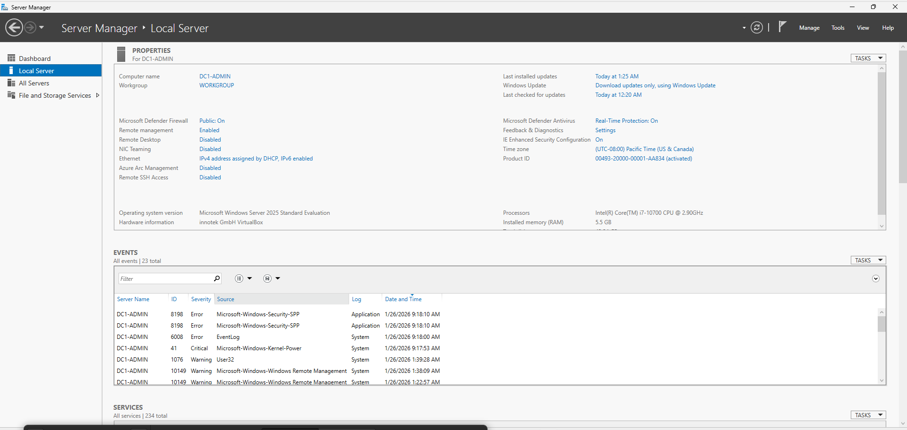


#### ... and set a static IP address
Then, you should make your server have a **static IP address** to ensure network connectivity otherwise:
   - DNS points to `192.168.1.10` for `domolia.local` → if DC1 gets a new IP, DNS breaks
   - Workstations are configured to find DNS at `192.168.1.10` → if it changes, they can't log in
   - Replication between DCs uses IP addresses → changing IPs breaks replication

#### But, how to Choose the Static IP Address ?

**Reminder:**

Private IP ranges are reserved for internal networks (not routable on the internet):

| Class | Range | Default Subnet | Typical Use |
|-------|-------|----------------|-------------|
| Class A | `10.0.0.0` – `10.255.255.255` | 255.0.0.0 | Large enterprises |
| Class B | `172.16.0.0` – `172.31.255.255` | 255.255.0.0 | Medium networks |
| Class C | `192.168.0.0` – `192.168.255.255` | 255.255.255.0 | Home/small office ✅ |

So for our VirtualBox lab, we'll use **Class C** (`192.168.x.x`).

**Here is an IP Scheme layout:**

| Device | IP Address | Subnet Mask | Gateway | DNS |
|--------|------------|-------------|---------|-----|
| **DC1-ADMIN** (1st server) | `192.168.1.10` | `255.255.255.0` | `192.168.1.1` | `127.0.0.1` (itself) |
| **DC2-WORKSHOP** (2nd server) | `192.168.2.10` | `255.255.255.0` | `192.168.2.1` | `192.168.1.10` (DC1) |
| Admin Workstation (Win11) | `192.168.1.20` | `255.255.255.0` | `192.168.1.1` | `192.168.1.10` |
| Workshop Workstation (Win11) | `192.168.2.20` | `255.255.255.0` | `192.168.2.1` | `192.168.1.10` or `192.168.2.10` |

**Network Diagram:**
```
┌─────────────────────────────────┐     ┌─────────────────────────────────┐
│  ADMINISTRATION/OFFICE BUILDING │     │      WORKSHOP BUILDING          │
│   Subnet: 192.168.1.0/24        │     │      Subnet: 192.168.2.0/24     │
│                                 │     │                                 │
│   192.168.1.10 = DC1-ADMIN      │     │   192.168.2.10 = DC2-WORKSHOP   │
│   192.168.1.20 = Admin PC       │     │   192.168.2.20 = Workshop PC    │
│   192.168.1.1  = Gateway        │     │   192.168.2.1  = Gateway        │
└─────────────────────────────────┘     └─────────────────────────────────┘
              │                                       │
              └───────────── Router ──────────────────┘
```

**Why separate subnets?**
- **Network segmentation**: If one building has a network issue (broadcast storm, malware), it doesn't affect the other
- **Security**: You can apply firewall rules between subnets (e.g., workshop can't access admin shares directly)
- **Scalability**: Each subnet supports 254 hosts (`.1` to `.254`). Separate subnets = more room to grow
- **Troubleshooting**: Easier to identify where a device is located by its IP

Since it is only a lab, you can use the same gateway IP for both subnets (`.1`), but in a real network, they would be different physical routers or VLAN interfaces.

Our diagram would actually look like this:

```
┌─────────────────────────────────┐     ┌─────────────────────────────────┐
│  ADMINISTRATION/OFFICE BUILDING │     │      WORKSHOP BUILDING          │
│   Subnet: 192.168.1.0/24        │     │      Subnet: 192.168.2.0/24     │
│                                 │     │                                 │
│   192.168.1.10 = DC1-ADMIN      │     │   192.168.1.11 = DC2-WORKSHOP   │
│   192.168.1.20 = Admin PC       │     │   192.168.1.21 = Workshop PC    │
│   192.168.1.1  = Gateway        │     │   192.168.1.1  = Gateway        │
└─────────────────────────────────┘     └─────────────────────────────────┘
```

**Why `.10` for Servers and `.20` for Workstations?**

This is a **convention**, not a rule. But it helps with:

| IP Range | Device Type | Why? |
|----------|-------------|------|
| `.1` | Gateway/Router | Standard convention (first usable IP) |
| `.2` – `.9` | Reserved | For future network infrastructure (switches, APs, printers) |
| `.10` – `.19` | Servers | Easy to spot: "Any `.1x` IP is a server" |
| `.20` – `.99` | Workstations | Plenty of room for employees |
| `.100` – `.199` | DHCP range | For guests or dynamic devices |
| `.200` – `.254` | Reserved | Printers, IoT, special devices |

**Example mental shortcut:**
- See `192.168.1.47`? → It's a workstation in Administration building
- See `192.168.2.10`? → It's a server in Workshop building

You can verfiy your network configuration opening a terminal and typing the `ipconfig` command. You should see something like this:
```powershell
> ipconfig
Windows IP Configuration

Ethernet adapter Ethernet:

   Connection-specific DNS Suffix  . :
   Link-local IPv6 Address . . . . . : fe80::38c4:bdad:b357:a3b0%13
   IPv4 Address. . . . . . . . . . . : 192.168.1.10
   Subnet Mask . . . . . . . . . . . : 255.255.255.0
   Default Gateway . . . . . . . . . : 192.168.1.1
```

1. Right-click the network icon → **Open Network & Internet settings** → **Change adapter options** or click on the ethernet link from the Server Manager in "Local Server"
2. Right-click your Ethernet adapter → **Properties**
3. Select **Internet Protocol Version 4 (TCP/IPv4)** → **Properties**
4. Select ⦿ **Use the following IP address:**
   - **IP address:** `192.168.1.10`
   - **Subnet mask:** `255.255.255.0`
   - **Default gateway:** `192.168.1.1` (your router/NAT)
5. Select ⦿ **Use the following DNS server addresses:**
   - **Preferred DNS:** `127.0.0.1` (since it will be the first domain controller and it will host and be its own DNS server after AD install)
6. Click **OK** → **Close**

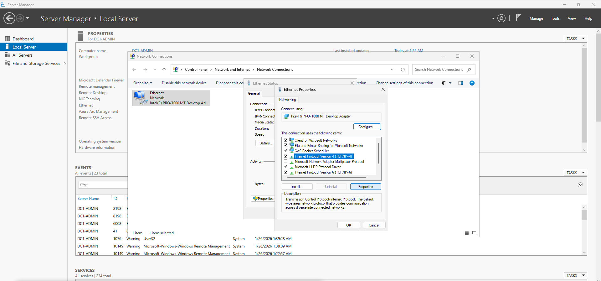
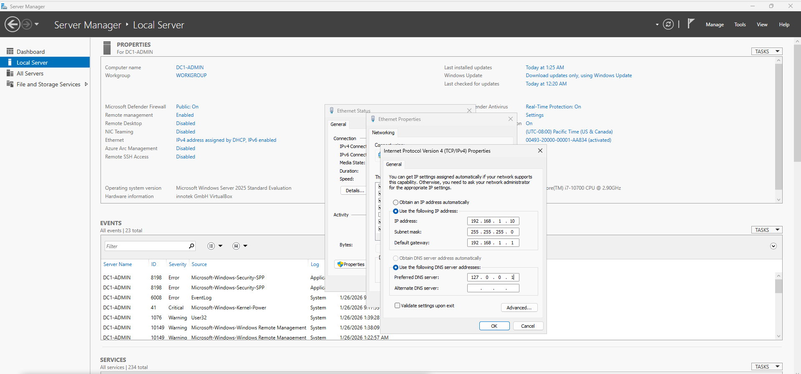


#### Now that the static IP is set, let's proceed to install Active Directory and create our forest !

1. **Open Server Manager** (will opens automatically on login)

2. **Add the AD DS Role:**
   - Click **Manage** (top-right) → **Add Roles and Features**
   - Click **Next** until you reach **Server Roles**
   - Check ☑ **Active Directory Domain Services**
   - A popup appears → Click **Add Features**
   - Click **Next** → **Next** → **Install**
   - Wait for installation (takes 2-3 minutes)
   - Click **Close** when done

   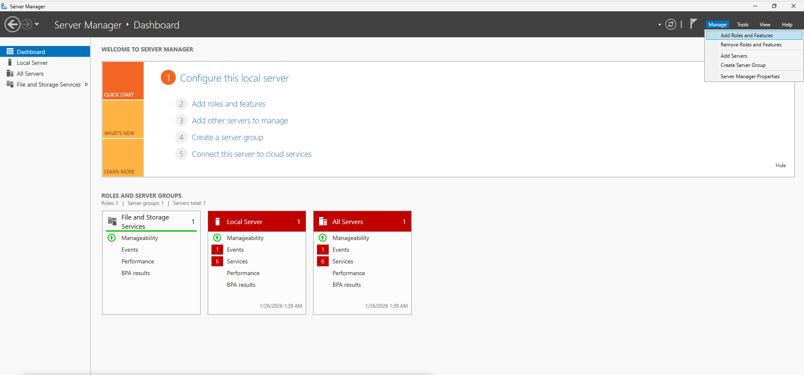
   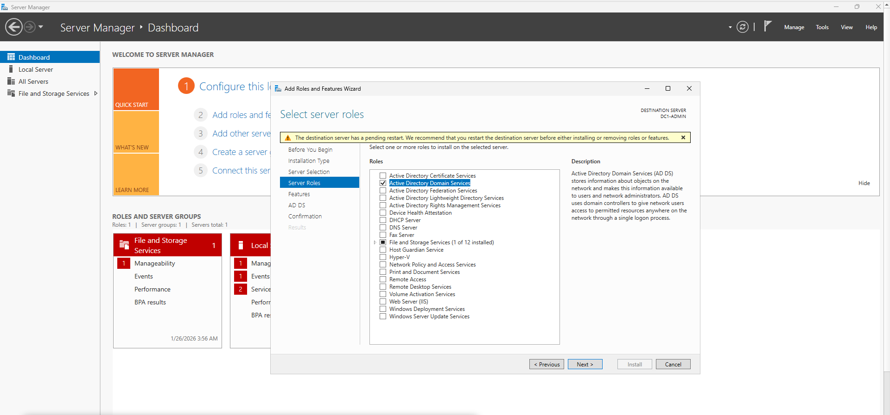

3. **Promote to Domain Controller:**
   - You'll see a yellow warning flag (⚠️) at the top-right in Server Manager
   - Click it → Click **Promote this server to a domain controller**
   
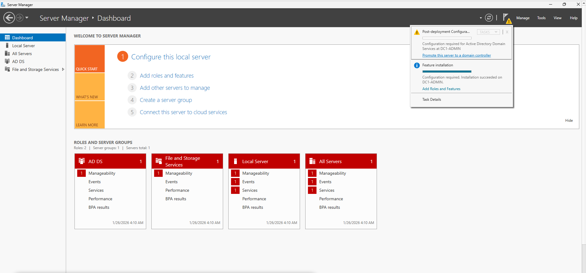

4. **Deployment Configuration:**
   - Select ⦿ **Add a new forest**
   - **Root domain name:** `domolia.local`
     - `.local` is standard for internal domains (not accessible from internet)
   - Click **Next**

5. **Domain Controller Options:**
   - **Forest functional level:** Windows Server 2025 or higher (use highest available)
   - **Domain functional level:** Windows Server 2025 or higher
   - Keep ☑ **Domain Name System (DNS) server** checked
   - Keep ☑ **Global Catalog (GC)** checked
   - **DSRM Password:** Enter a strong password (used for disaster recovery mode)
     - ⚠️ **Don't forget this password !** — you'll need it if AD fails
   - Click **Next**

6. **DNS Options:**
   - Warning about DNS delegation — **ignore this** (normal for new forests)
   - Click **Next**

7. **Additional Options:**
   - **NetBIOS domain name:** DOMOLIA (auto-filled, uppercase version)
   - Click **Next**

8. **Paths:**
   - Accept defaults (C:\Windows\NTDS for database, C:\Windows\SYSVOL for shared files)
   - Click **Next**

9. **Review Options:**
   - Review your settings
   - Click **Next**

10. **Prerequisites Check:**
    - Wait for validation (takes 1-2 minutes)
    - If the prerequisites failed, fix any issues and restart your server
    - Click **Install**

11. **Installation:**
    - Takes 5-10 minutes
    - Server will **automatically reboot** when done
    - ⚠️ **Do not close or interrupt**

12. **After Reboot:**
    - Log in with: **DOMOLIA\Administrator** 
    - 🎉 **Your forest is created!**


#### Verifying Your Forest

After reboot, verify everything works:

**1. Check server manager:**
You will see new tabs for Active Directory and DNS in Server Manager. You will also have new "tools" related to AD.
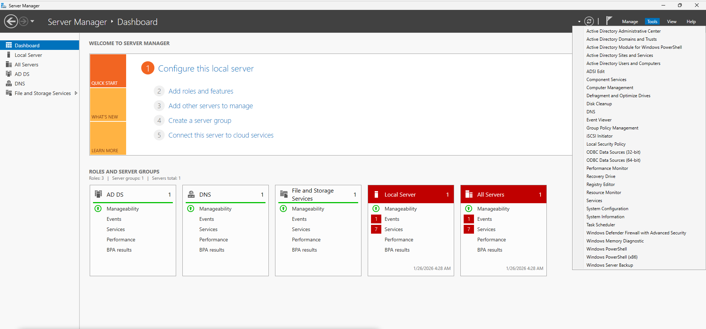

**2. Check DNS:**
```powershell
>nslookup domolia.local
DNS request timed out.
    timeout was 2 seconds.
Server:  UnKnown
Address:  ::1

Name:    domolia.local
Address:  192.168.1.10
```
Should return your DC's IP

Now that the forest is created, let's connect the second server to it !

#### Now let's configure the Domain controller 

Actually, we already did configure a domain controller...
That was when we created the forest on the first server (DC1-ADMIN). Since a forest always starts with a domain controller. So now we just need to connect the second server (DC2-WORKSHOP) to the forest and promote it to a domain controller as well.

But before that, like for the DC-ADMIN, we need to first:
- Set hostname: DC2-WORKSHOP
- Set static IP: 192.168.1.11, subnet 255.255.255.0, gateway 192.168.1.1
- Set DNS to **192.168.1.10** (first DC's IP)
- Join the server to the **domolia.local** domain first
  - System Properties > Computer Name > Change > Domain: domolia.local
  - Use your server Domain Admin credentials; reboot

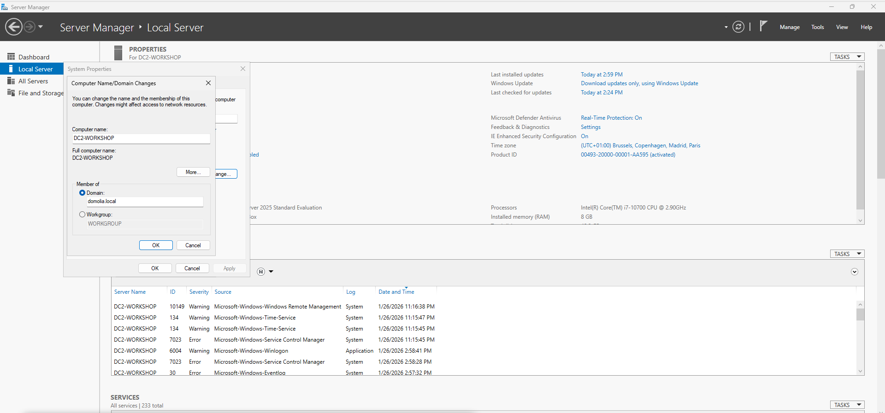

**Reminder**
The 2 servers VM should be on the same network so they can communicate together (here a host-only network in VirtualBox) and of course both servers should be up and running. 

Let's configure the second domain controller now:
1) Manage > Add Roles and Features > Role-based > AD DS (include management tools)
2) After install, click "Promote this server to a domain controller"
3) Select "Add a domain controller to an existing domain"
   - Domain: `domolia.local`
   - **Change credentials:** Click "Change" and enter:
     - Username: `DOMOLIA\Administrator` (from DC1)
     - Password: The password you set when creating the forest
   - Check ☑ "Domain Name System (DNS) server" 
   - Check ☑ "Global Catalog"
   - Set DSRM password (strong password for disaster recovery)
   - Click Next until Install (server will reboot)

After both DCs are up, the AD structure should look like this:
```
DC1-ADMIN (server name)    DC2-WORKSHOP (server name)
    │                            │
    └─── DOMOLIA\Administrator (same account, replicated)
    └─── DOMOLIA\admin.user     (same account, replicated)
    └─── All OUs & groups       (all replicated)
```
So the local users used to log into the admin/office server is replace by this new domain user DOMOLIA\Administrator and the same is true for the workshop server. So now both servers use the same domain user to log in and their old local users were either replace by DOMOLIA\Administrator or still exist but they are not require. 

Verify:
- Both DCs show in Active Directory Sites and Services
- Add on DC1-ADMIN an alternate DNS server pointing to DC2-WORKSHOP IP
- Run `repadmin /replsummary` on either DC
```
>repadmin /replsummary
Replication Summary Start Time: 2026-01-26 08:06:02

Beginning data collection for replication summary, this may take awhile:
  .....


Source DSA          largest delta    fails/total %%   error
 DC1-ADMIN                 08m:56s    0 /   5    0
 DC2-WORKSHOP              06m:07s    0 /   5    0


Destination DSA     largest delta    fails/total %%   error
 DC1-ADMIN                 06m:07s    0 /   5    0
 DC2-WORKSHOP              08m:50s    0 /   5    0

```
- Both DCs should have identical user/OU structures

Alright, now that both domain controllers are up and running in the same forest and domain, let's create our shares and user accounts !

---

#### User account creation and resources creation

Since we have a single domain (domolia.local), all users and groups are in one place.

To properly set up file shares with correct permissions, follow these steps:
1. Create **OUs in Active Directory** — to organize users and groups
2. Create **user accounts** in those OUs
3. Create **security groups** and assign users to them
4. Create **file system folders** (shares on disk) — knowing which accounts will access them
5. Apply **NTFS permissions** on the folders, granting access to specific groups (not "Everyone")


Why create OUs?
- Organization: keep users, groups, and computers structured by department or role (e.g., Administration, Workshop).
- Delegation: safely delegate day‑to‑day tasks (reset passwords, create users) to specific staff for a specific OU without granting domain‑wide admin.
- Group Policy targeting: link GPOs to OUs to apply settings only to the intended users/computers (e.g., different drive mappings or workstation settings per area).
- Lifecycle management: move/disable/archive accounts by OU, making audits and cleanup easier.
- Clarity and scalability: as the directory grows, OUs prevent a flat, messy Users container.


**Step 1: Create Organizational Units (OUs) in Active Directory**

Click to tools > **Active Directory Users and Computers** to open it. 
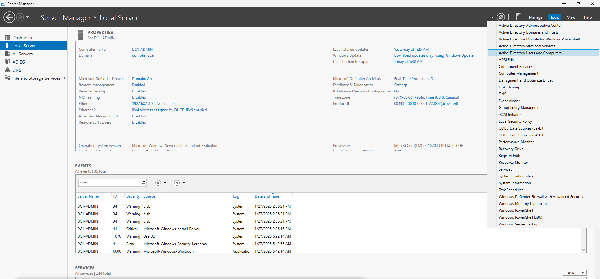

You can see that we now have our domain "domolia.local" created with the two servers as domain controllers.
It is here where we will create our Organizational Units (OUs) and user accounts.
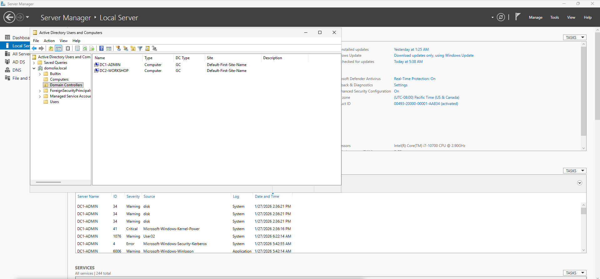
On DC1-ADMIN, open **Active Directory Users and Computers**:
1) Right-click domolia.local > New > Organizational Unit
   - Name: **Administration** (can keep the "Protect from accidental deletion" checked)
   - Purpose: This OU will contain user accounts that need access to Administration resources
2) Create OU: **Workshop**
   - Purpose: This OU will contain user accounts that work with Workshop resources
3) Create OU: **Groups**
   - Purpose: This OU will contain security groups that control share access

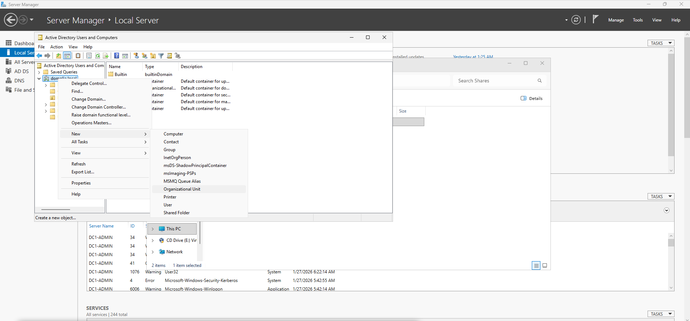


**Step 2: Create Security Groups**
In the **Groups** OU, create three Global security groups:
   Right-click domolia.local > New > group
- **GG_Admin_RW** — for Administration share access
- **GG_Generic_RW** — for Generic share access (all users)
- **GG_Projects_RW** — for Projects share access


**Step 3: Create User Accounts**

**Administration user:**
- OU: Administration
- Right-click domolia.local > New > User
- Username: admin.user (or alice.manager)
- Member of: GG_Admin_RW, GG_Generic_RW

**Workshop user:**
- OU: Workshop
- Right-click domolia.local > New > User
- Username: workshop.user (or bob.worker)
- Member of: GG_Projects_RW, GG_Generic_RW

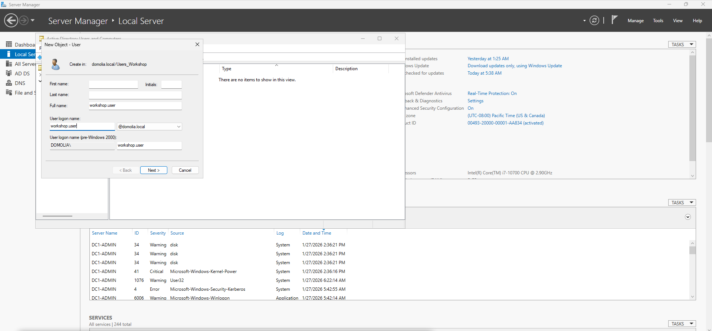
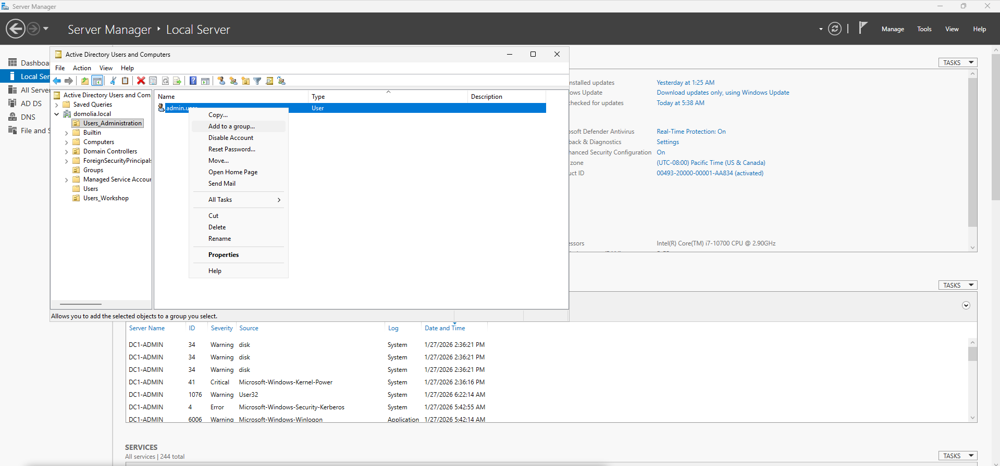
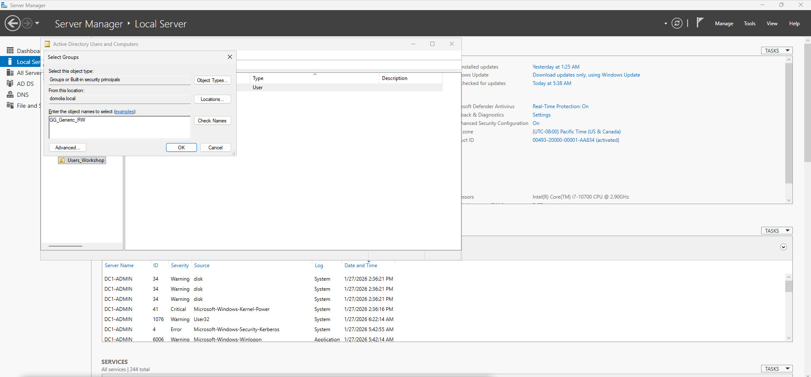
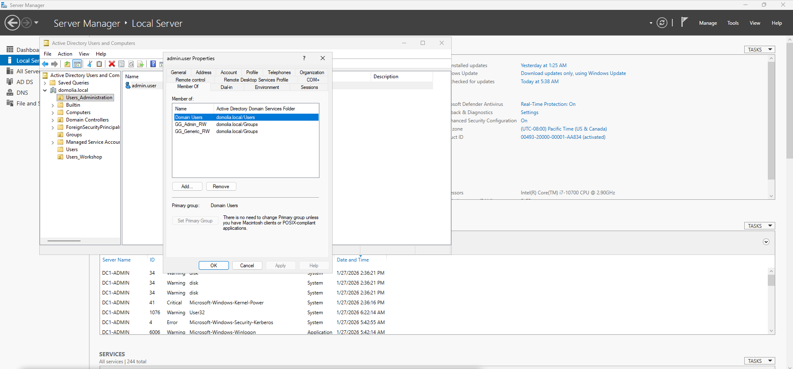

**Now we know our users and groups exist. Let's create the file system folders.**

**Step 4: Create Folders and Set Up Shares**

Folder structure we're building:

```
DC1-ADMIN (C:\ drive)
└─ Shares\
   ├─ Administration\         ← Accessible by: admin.user (via GG_Admin_RW group)
   └─ Generic\                ← Accessible by: admin.user + workshop.user (via GG_Generic_RW group)

DC2-WORKSHOP (C:\ drive)
└─ Shares\
   └─ Projects\               ← Accessible by: workshop.user (via GG_Projects_RW group)
```

**On DC1-ADMIN (Administration Building) — 192.168.1.10:**

1) Create folders via PowerShell:
   ```powershell
   New-Item -Path "C:\Shares\Administration" -ItemType Directory
   New-Item -Path "C:\Shares\Generic" -ItemType Directory
   ```

2) Share them:
   - Right-click each folder > Properties > Sharing > Advanced Sharing
   - Share name: **Administration** and **Generic**
   - Share permissions: add the GG_Admin_RW group for Administration share and GG_Generic_RW for Generic share with Read/Write permission.

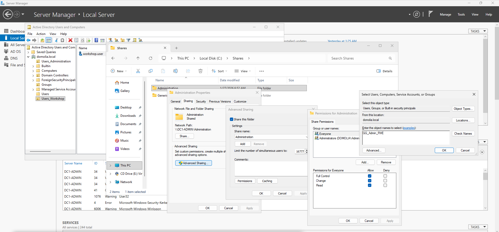

You can remove the access for "Everyone" if it is present.

**On DC2-WORKSHOP (Workshop Building) — 192.168.1.11:**

1) Create folder:
   ```powershell
   New-Item -Path "C:\Shares\Projects" -ItemType Directory
   ```

2) Share it:
   - Right-click > Properties > Sharing > Advanced Sharing
   - Share name: **Projects**
   - Share permissions: add the GG_Projects_RW group for Projects share with Read/Write permission.

You can remove the access for "Everyone" if it is present.

#### What is NTFS and how do permissions work?

**Two layers of permissions:**

Network access: `\\DC1-ADMIN\Administration` → checks Share perms first, then NTFS
Local access: `C:\Shares\Administration` (at server console) → NTFS ONLY

```
┌────────────────────────────────────────────────────────────────┐
│ SCENARIO 1: Network Access (from workstation)                 │
│                                                                │
│  [Workstation] ──────→ \\DC1-ADMIN\Administration            │
│       ↓                                                        │
│   Step 1: Check SHARE permissions (did user get through?)     │
│       ↓                                                        │
│   Step 2: Check NTFS permissions (what can they do?)          │
│       ↓                                                        │
│   Result: MOST RESTRICTIVE wins                               │
└────────────────────────────────────────────────────────────────┘

┌────────────────────────────────────────────────────────────────┐
│ SCENARIO 2: Local Access (sitting at the server console)      │
│                                                                │
│  [Admin at DC1-ADMIN] ──→ C:\Shares\Administration           │
│       ↓                                                        │
│   Step 1: Share permissions = SKIPPED (not network access)    │
│       ↓                                                        │
│   Step 2: Check NTFS permissions ONLY                         │
│       ↓                                                        │
│   Result: NTFS is the ONLY protection                         │
└────────────────────────────────────────────────────────────────┘
```

**What does "over the network" mean?**
- Network access = using a UNC path like `\\DC1-ADMIN\Administration` from another computer
- Local access = directly opening `C:\Shares\Administration` at the server itself

**Why you need BOTH:**

| Scenario | Share Perms | NTFS Perms | Result | Why? |
|----------|-------------|------------|--------|------|
| Network user connects | GG_Admin_RW = Full | GG_Admin_RW = Modify | **Modify** | Most restrictive wins |
| Network user connects | GG_Admin_RW = Read | GG_Admin_RW = Modify | **Read** | Share blocks them first |
| Network user connects | Everyone = Full | GG_Admin_RW = Modify | **Modify** | NTFS enforces security |
| Local admin at server | (skipped) | Everyone = Full | **Full** | ⚠️ No protection! |
| Network + bad NTFS | GG_Admin_RW = Read | Everyone = Full | **Read** | Share saved you |

**What if you only used Share permissions (no NTFS)?**
- ❌ Anyone with local/console access bypasses ALL security
- ❌ No inheritance control (can't set different perms for subfolders)
- ❌ No auditing of file access
- ❌ No owner tracking

**What if you only used NTFS (no Share)?**
- ❌ Can't create network shares at all
- But if the share exists with Everyone=Full: NTFS alone protects the files

**Best practice:**
1. **Share permissions**: Grant the intended group **Change** or **Full Control**, remove **Everyone**
2. **NTFS permissions**: Grant the intended group **Modify**, remove **Everyone** 
3. Result: Secure for both network and local access, NTFS enforces least privilege

Apply NTFS Permissions on shares in the Properties > Sharing > Advanced Sharing > Security:
    C:\Shares\Administration → GG_Admin_RW (Modify)
    C:\Shares\Generic → GG_Generic_RW (Modify)
    C:\Shares\Projects → GG_Projects_RW (Modify)


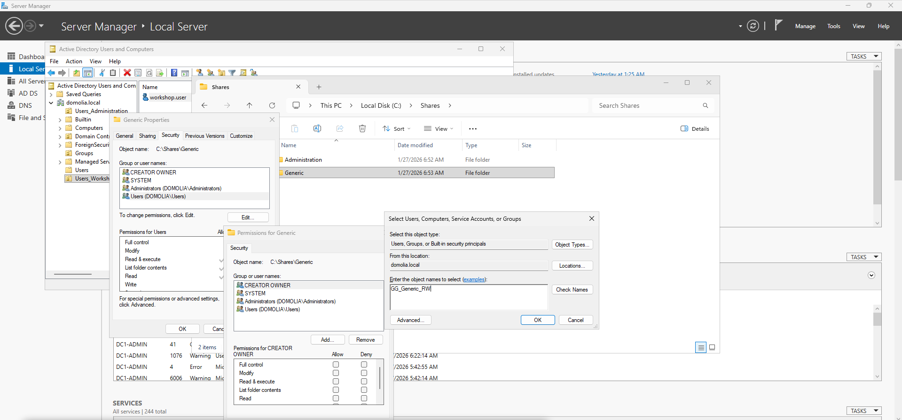
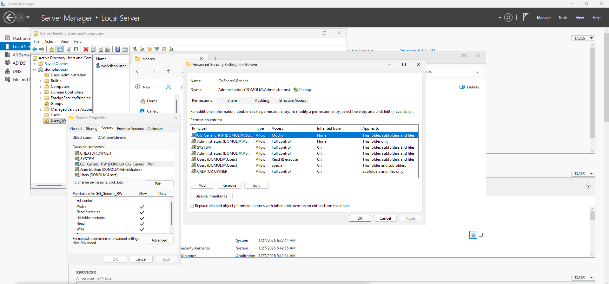


#### Connecting Windows 11 Workstation to the Domain

You may got problems booting with windows 11, just type esc to boot on your iso.


1) Join both Windows 11 clients to **domolia.local**:
   - **Make sure that your windows 11 are in the same network as your server and don't forget to modify its IP and DNS !**
   - Settings > System > About > Domain: domolia.local
   - Use Domain Admin credentials; reboot

2) Log in to the Administration client as **DOMOLIA\admin**:
   - Verify access to \\DC1-ADMIN\Administration (Read/Write)
   - Verify access to \\DC1-ADMIN\Generic (Read/Write)
   - Should NOT have write access to \DC2-WORKSHOP\Projects

3) Log in to the Workshop client as **DOMOLIA\workshop**:
   - Verify access to \\DC2-WORKSHOP\Projects (Read/Write)
   - Verify access to \\DC1-ADMIN\Generic (Read/Write)
   - Should NOT have write access to \\DC1-ADMIN\Administration

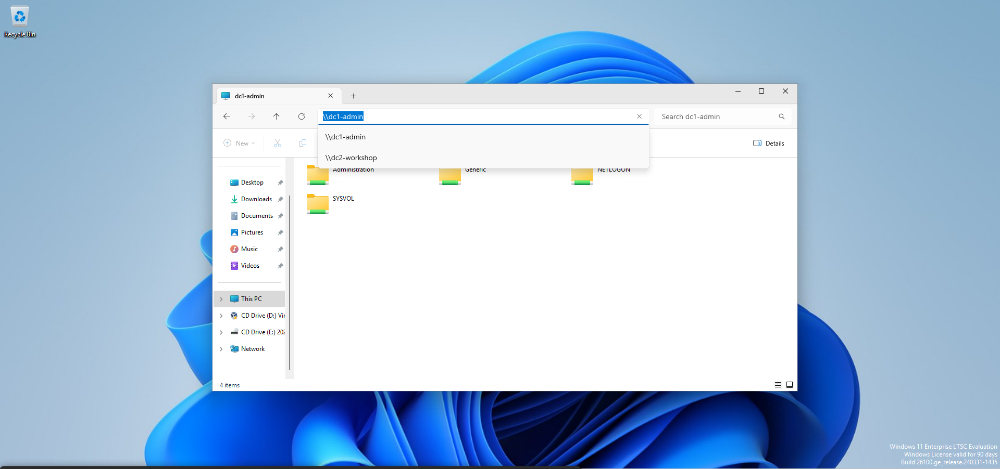


##### In Summary

```
DC1-ADMIN:
├─ C:\Shares\Administration (for admin users)
└─ C:\Shares\Generic (for all users)

DC2-WORKSHOP:
└─ C:\Shares\Projects (for workshop users)

Users:
├─ admin.user → can access Administration + Generic
└─ workshop.user → can access Projects + Generic
```


That's it !
That was the first project of the windows branch, next to go [Automatic Directory]. Let's learn some powershell scripting !


### Resources
- https://learn.microsoft.com/en-us/training/paths/administer-active-directory-domain-services/
- https://learn.microsoft.com/fr-fr/windows-server/identity/identity-and-access
- [Step by stp blog on how to configure an AD](https://www.transip.eu/knowledgebase/configuring-an-active-directory-in-windows-server-2019-or-2022)
- https://www.techtarget.com/searchwindowsserver/definition/Active-Directory-forest-AD-forest
- https://medium.com/@ademolaivamos7/building-my-homelab-part-1-setting-up-windows-server-2022-in-virtualbox-db09dfe55c4d
- [tuto playlist](https://www.youtube.com/watch?v=8i13-RklYMI&list=PLd8Sl178d4fSIFtCiHKAhIjj7eZlTAdhO&index=2)
- https://youtu.be/85-bp7XxWDQ?si=h2vBlj2WXVXqjS1U
- https://youtu.be/7xOUsirYLYU?si=dGb7gVPXpzg-4N_q
- https://youtube.com/playlist?list=PLQ6jKtBHSpE8C6zLCPDbLjqX4PyC0-qKe&si=edEjfQw_OEdIvLdW
- https://youtu.be/ADakXsa8ry8?si=LPoj8pBEMbREDG1H
- https://stackoverflow.com/questions/16481110/deleting-ous-in-active-directory-users-and-computers
- https://youtu.be/a7OqdLAdK28?si=2tDLuDPw932h8nuG